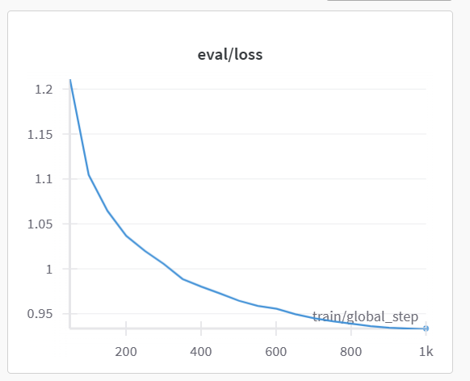

# Mistral GBiuT
We are using the open-source Mistral-7B to train our own personal GPT.

### Fine-tuning Mistral 7B
In the `full_fintuning.ipynb`, we utilize Meta released Unnatrual Instruction dataset for fine-tuning. My current set up will lead to OOM with full fine-tuning. Hence, we incorporate LoRA to finetune the model. We used Unnatrual Instruction core, and the total trained time is 10hr to fine-tune on GTX3090 224GB.

### Instruction Dataset Generation
TBD
